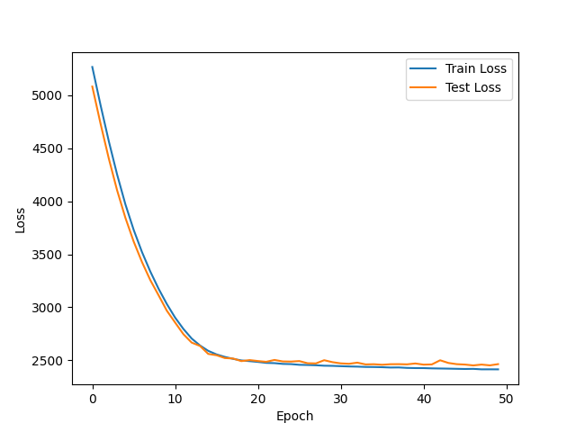
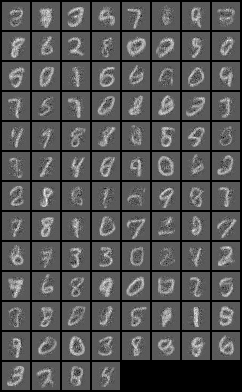
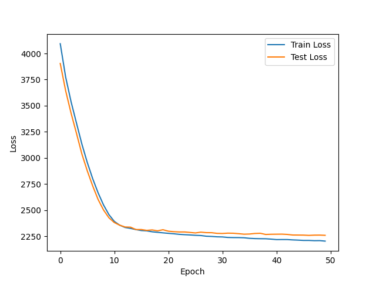
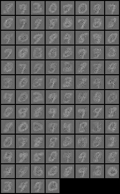
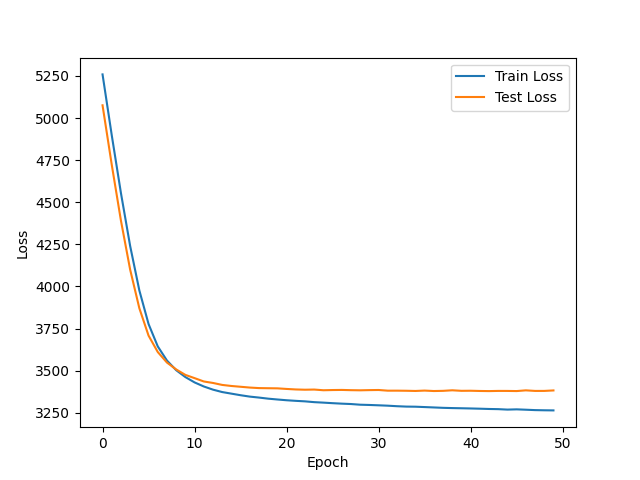
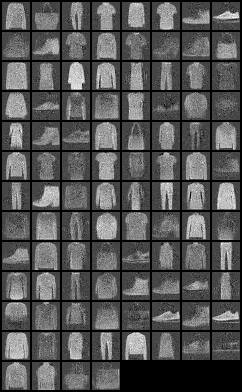
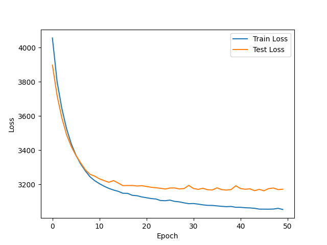
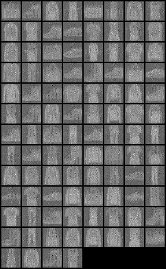

# NICE: Non-linear Independent Components Estimation Implementation

## Introduction
This is NICE (Non-linear Independent Components Estimation) architecture implementation. This project is structured to training over different configurations and datasets.
For more detailed information and theoretical background, refer to the original paper on NICE. You can access it here: [NICE: Non-linear Independent Components Estimation](https://arxiv.org/abs/1410.8516).

## Project Structure
The project includes several key directories:
- `data`: Contains datasets used in the model.
- `docs`: Documentation and visualizations of the model outputs.
- `models`: Model definitions and saved model states.
- `plots`: Directory for generated plots (currently empty).
- `samples`: Directory for sample outputs (currently empty).
- `nice.py`: The main script defining the NICE model.
- `train.py`: Script for training the model.

## Documentation and Visualizations
The `docs` directory includes visualizations for two types of transformations - `additive` and `affine`, applied to two datasets: `MNIST` and `Fashion-MNIST`. 

### Transformation Comparisons

#### MNIST
| Transformation Type | Image 1 | Image 2 |
| -------------------- | ------- | ------- |
| **Additive** |  |  |
| **Affine** |  |  |

#### Fashion-MNIST
| Transformation Type | Image 1 | Image 2 |
| -------------------- | ------- | ------- |
| **Additive** |  |  |
| **Affine** |  |  |
